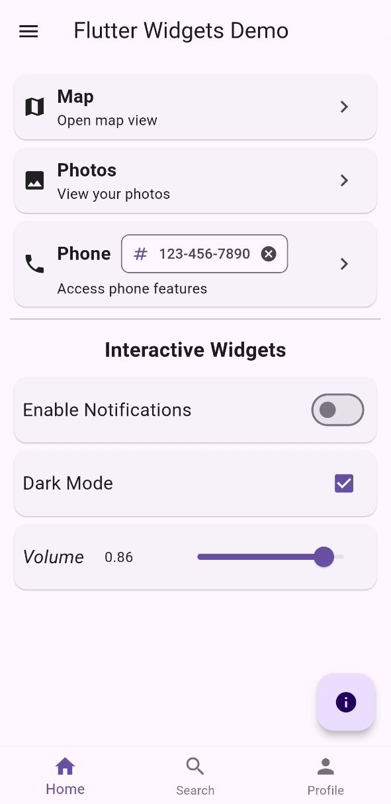

# Flutter Widgets Tutorial

This project is a comprehensive tutorial on the most common widgets in Flutter, providing practical 
examples and detailed explanations to help developers build robust and efficient mobile applications.

## How to Run the Project

1. Clone the repository:
   ```bash
   git clone https://github.com/betazetadev/flutter-widgets-common.git
   ```

2. Navigate to the project directory:
   ```bash
   cd flutter-widgets-common
   ```

3. Install the dependencies:
   ```bash
   flutter pub get
   ```

4. Run the application:
   ```bash
   flutter run
   ```

## Example Screenshot



## License

This project is licensed under the GNU General Public License v3.0. See the [LICENSE](LICENSE) file for details.

## Contact

If you have any questions or suggestions, feel free to contact me at [hi@betazeta.dev].